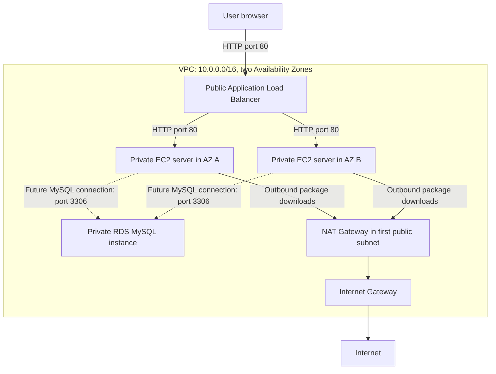

# AWS Multi-Tier Application with Terraform

This project provisions an AWS application environment using three reusable Terraform modules: networking, database, and compute. It is a learning project for understanding how a public load balancer, private web servers, and a managed database fit together.

This guide explains the existing code, walks through deployment and verification, and shows how to remove the resources. The final sections describe the changes needed for separate development and production environments and CI/CD.

**Current behavior:** the web servers display an Apache page containing the RDS endpoint. They do not yet run application code that connects to MySQL. The infrastructure spans two Availability Zones, but the database is not configured for Multi-AZ failover and there is only one NAT Gateway.

## Contents

1. [Architecture and current configuration](#architecture-and-current-configuration)
2. [Project structure and Terraform concepts](#project-structure-and-terraform-concepts)
3. [Before you begin](#before-you-begin)
4. [Phase 1: Networking module](#phase-1-networking-module)
5. [Phase 2: Database module](#phase-2-database-module)
6. [Phase 3: Compute module](#phase-3-compute-module)
7. [Phase 4: Connect the modules](#phase-4-connect-the-modules)
8. [Phase 5: Deploy the project](#phase-5-deploy-the-project)
9. [Phase 6: Verify the deployment](#phase-6-verify-the-deployment)
10. [Make changes safely](#make-changes-safely)
11. [Troubleshooting](#troubleshooting)
12. [Clean up the environment](#clean-up-the-environment)
13. [Next phase: Separate development and production](#next-phase-separate-development-and-production)
14. [Next phase: Remote state and CI/CD](#next-phase-remote-state-and-cicd)

## Architecture and current configuration

The three tiers have different responsibilities:

| Tier | AWS resources | Responsibility |
| --- | --- | --- |
| Entry point | Application Load Balancer (ALB), listener, target group | Accept HTTP requests and forward them to web servers. |
| Compute | EC2 launch template, Auto Scaling Group (ASG) | Run Apache on private EC2 instances. |
| Data | RDS MySQL instance, DB subnet group | Provide a database for a future application. |

All three tiers use the VPC created by the networking module.



The ALB uses both public subnets. The ASG uses both private subnets; its desired capacity starts at two instances. The RDS subnet group includes both private subnets, but that alone does not create a standby database. The dashed lines show the intended application-to-database traffic, which the demo page does not generate.

### Defaults in the code

| Setting | Current value | Where it is configured |
| --- | --- | --- |
| AWS Region | `ap-south-1` (Mumbai) | `provider.tf` |
| AWS provider constraint | `~> 6.0`, allowing 6.x releases | `provider.tf` |
| VPC CIDR | `10.0.0.0/16` | Root `main.tf` |
| Public subnet CIDRs | `10.0.1.0/24`, `10.0.2.0/24` | Root `main.tf` |
| Private subnet CIDRs | `10.0.3.0/24`, `10.0.4.0/24` | Root `main.tf` |
| EC2 operating system | Latest Amazon-owned image matching the Amazon Linux 2023 x86_64 filter | `modules/compute/main.tf` |
| EC2 instance type | `t2.micro` | `modules/compute/variables.tf` |
| ASG minimum / desired / maximum | `1` / `2` / `4` | `modules/compute/main.tf` |
| Database engine | MySQL, version prefix `8.0` | `modules/database/main.tf` |
| Database instance class | `db.t3.micro` | `modules/database/variables.tf` |
| Database storage | `20` GiB | `modules/database/main.tf` |
| Initial database / administrator | `myappdb` / `admin` | `modules/database/variables.tf` |
| Database password | Generated, 16 characters | `modules/database/main.tf` |
| Website protocol | HTTP on port `80` | `modules/compute/main.tf` |
| Terraform state | Local backend; no remote backend configured | Terraform's default behavior |

### Scope of this version

- The ALB accepts HTTP; an HTTPS listener, certificate, and custom domain are not configured.
- The ASG maintains its desired capacity. No scaling policy is defined to increase capacity when CPU usage or request traffic rises. `max_size = 4` only defines an upper limit.
- The ALB checks the web page, but the ASG does not explicitly enable ELB health checks. Its default EC2 health checks do not verify that Apache serves a working page. See [AWS Auto Scaling health checks](https://docs.aws.amazon.com/autoscaling/ec2/userguide/health-checks-overview.html).
- The database security group permits MySQL traffic from the entire VPC CIDR. Restricting it to the web server security group is a future improvement.
- The database has no explicit Multi-AZ, backup-retention, storage-encryption, or deletion-protection settings. Inspect the plan and configure these deliberately before storing important data.
- The single NAT Gateway serves both private subnets. Its Availability Zone is a shared dependency for outbound internet access.
- Separate environments, remote state, and CI/CD are not implemented yet.

## Project structure and Terraform concepts

```text
MultiTierApplication/
├── provider.tf              # Provider requirement and AWS Region
├── main.tf                  # Calls the modules and passes their inputs
├── outputs.tf               # Exposes the website URL
├── .terraform.lock.hcl      # Provider versions and checksums
├── readme.md
└── modules/
    ├── vpc/
    │   ├── main.tf          # VPC, subnets, gateways, routes, associations
    │   ├── variables.tf     # VPC and subnet CIDR inputs
    │   └── outputs.tf       # VPC ID and subnet IDs
    ├── database/
    │   ├── main.tf          # Database firewall, subnet group, password, RDS
    │   ├── variables.tf     # Network inputs and database defaults
    │   └── outputs.tf       # RDS connection endpoint
    └── compute/
        ├── main.tf          # Firewalls, ALB, launch template, ASG
        ├── variables.tf     # Network inputs, DB endpoint, EC2 type
        └── outputs.tf       # ALB DNS name
```

Terraform reads all `.tf` files in the directory where you run it as one root module. File names organize the code; Terraform does not execute `provider.tf`, then `main.tf`, then `outputs.tf` in order. It builds a dependency graph from references between resources.

| Concept | Meaning | Example in this project |
| --- | --- | --- |
| Provider | Plugin used to manage a service or generate values | `hashicorp/aws`, `hashicorp/random` |
| Resource | An object Terraform creates and manages | `resource "aws_vpc" "main-vpc"` |
| Data source | A lookup of existing information | Available AZs and the latest matching AMI |
| Variable | An input to a module | `var.private_subnet_ids` |
| Output | A value a module makes available to its caller | `module.database.db_endpoint` |
| Module | A directory of reusable Terraform configuration | `source = "./modules/vpc"` |
| State | Terraform's record linking resource addresses to real objects | Local `terraform.tfstate` after deployment |

For example, `aws_db_instance.database.endpoint` means the `endpoint` attribute of the RDS resource named `database`. The database module exports it, and the root module passes it into compute.

The code already exists. Read the walkthroughs to understand or modify it; you do not need to paste duplicate resource blocks into the files. When consulting the Terraform Registry, select the provider version recorded in `.terraform.lock.hcl` so the reference matches your installation.

## Before you begin

### 1. Install and verify the tools

Install a current Terraform CLI and AWS CLI v2 using the instructions for your operating system: [Terraform installation](https://developer.hashicorp.com/terraform/tutorials/aws-get-started/install-cli) and [AWS CLI installation](https://docs.aws.amazon.com/cli/latest/userguide/getting-started-install.html). The commands below use Bash; use Bash or WSL on Windows.

```bash
terraform version
aws --version
```

Both commands should print version information. You also need an AWS account, an identity allowed to provision the resources, and internet access to download providers and contact AWS APIs.

Permissions must cover VPC/EC2 networking, Elastic Load Balancing, Auto Scaling, and RDS, including their associated service-linked roles where required. A read-only AWS identity cannot deploy this project.

### 2. Configure AWS authentication

Use your organization's existing authentication method. If it uses IAM Identity Center, configure a named profile and sign in:

```bash
aws configure sso --profile terraform-learning
aws sso login --profile terraform-learning
export AWS_PROFILE=terraform-learning
```

The wizard asks for your organization's SSO details, account, and role. See [AWS CLI SSO configuration](https://docs.aws.amazon.com/cli/latest/userguide/cli-configure-sso.html) for the complete setup.

If your lab instead provides an access key and secret key, configure a named profile with `aws configure --profile terraform-learning`, then export the same `AWS_PROFILE` value. Do not put credentials in `.tf` files.

Confirm which account and identity will be used:

```bash
aws sts get-caller-identity
```

Check the returned `Account` and `Arn` before deploying. `AWS_PROFILE` applies to the current terminal session. Expired SSO sessions need another `aws sso login`.

The Terraform provider explicitly sets `ap-south-1`, so a different default Region in your CLI profile does not change this deployment's Region. The AWS inspection commands below pass `--region ap-south-1` for that reason.

### 3. Understand costs and local files

Applying this configuration creates billable resources, including EC2, RDS, an ALB, a NAT Gateway, storage, and public IPv4 addresses. Small instance types do not make the entire environment free. Use a learning account and destroy the environment when finished.

The generated database password is stored in Terraform state. Marking a value sensitive hides it from ordinary output; it does not remove it from state. Saved plans can also contain sensitive values. Keep state and plans private. See [Terraform sensitive-data handling](https://developer.hashicorp.com/terraform/language/manage-sensitive-data).

The repository's `.gitignore` already excludes `.terraform/`, state files, `.tfvars` files, and names containing `tfplan`. Keep `.terraform.lock.hcl` in version control; it serves a different purpose and records provider selections.

## Phase 1: Networking module

Read [modules/vpc/main.tf](modules/vpc/main.tf), [variables.tf](modules/vpc/variables.tf), and [outputs.tf](modules/vpc/outputs.tf) together.

### Step 1: Define the VPC address space

`aws_vpc.main-vpc` creates the network using `var.vpc_cidr`. The default `10.0.0.0/16` contains all four subnet ranges. DNS support and DNS hostnames are enabled so resources can use DNS names inside the VPC.

A CIDR block describes an IP address range. Each `/24` subnet is a smaller range within the `/16` VPC. Subnets must not overlap and must fit inside the VPC CIDR.

### Step 2: Discover Availability Zones and create subnets

`data.aws_availability_zones.available` looks up the available AZ names in the configured Region. Both subnet resources use `count`:

```hcl
count             = length(var.private_subnets)
availability_zone = data.aws_availability_zones.available.names[count.index]
cidr_block        = var.private_subnets[count.index]
```

For the two configured private subnet ranges, `count.index` is first `0`, then `1`. Terraform pairs the first CIDR with the first available AZ and the second CIDR with the second AZ. The public subnet resource follows the same pattern.

This produces a public/private subnet pair in each of two AZs. If you increase the subnet count, the Region must have enough available AZs for the indexed lookup.

### Step 3: Give public subnets an internet route

`aws_internet_gateway.gw` attaches an Internet Gateway to the VPC. `aws_route_table.public_rt` sends traffic for `0.0.0.0/0` to that gateway. The public route table associations attach this route table to both public subnets.

`0.0.0.0/0` is the default route for destinations not covered by a more specific route. The VPC's local route handles communication inside the VPC.

The public subnets also set `map_public_ip_on_launch = true`. A subnet's internet route is what makes it public; reachability of an individual resource still depends on its addressing and security rules.

### Step 4: Give private servers outbound internet access

`aws_eip.nat` allocates the Elastic IP used by `aws_nat_gateway.nat_gw`. The NAT Gateway is placed in the first public subnet and explicitly depends on the Internet Gateway.

`aws_route_table.private_rt` sends the private subnets' default route to the NAT Gateway. Its associations attach the route table to both private subnets.

The web server's package-download path is:

```text
Private EC2 instance -> private route table -> NAT Gateway
                    -> public route table -> Internet Gateway -> package repository
```

This lets a private instance initiate outbound connections and receive replies. It does not give internet clients a route to initiate connections to that instance. EC2-to-RDS traffic within the VPC uses the local route and does not pass through the NAT Gateway.

### Step 5: Export the network IDs

The module outputs `vpc_id`, `public_subnet_ids`, and `private_subnet_ids`. Expressions such as `aws_subnet.private-subnet[*].id` collect the IDs of all subnet instances created by `count` into a list.

**Checkpoint:** you should be able to explain why the ALB belongs in public subnets and why EC2 and RDS use private subnets. The output IDs are inputs needed by the other modules.

## Phase 2: Database module

Read [modules/database/main.tf](modules/database/main.tf), [variables.tf](modules/database/variables.tf), and [outputs.tf](modules/database/outputs.tf).

### Step 1: Control incoming database traffic

`aws_security_group.db_sg` permits TCP port `3306`, MySQL's port, from `var.vpc_cidr_block`. The root module currently supplies `10.0.0.0/16`.

This permits sources throughout the VPC address range. It does not yet restrict access to the compute module's web security group. If you change the VPC CIDR, update this database input too; they are currently separate literal values in root `main.tf`.

### Step 2: Create the DB subnet group

`aws_db_subnet_group.db_subnet_group` receives `var.private_subnet_ids`. A DB subnet group tells RDS which subnets it can use to place the database.

Providing subnets in two AZs supports RDS placement requirements. Database failover requires a separate Multi-AZ setting; listing two subnets does not enable it.

### Step 3: Generate the administrator password

`random_password.db_password` generates a 16-character password using letters, numbers, and the configured special-character set. RDS reads its `result` directly, so no literal password is written into the configuration.

The generated value is retained in Terraform state and reused across normal runs. It is not regenerated on every `terraform apply`.

This resource uses `hashicorp/random`. Only AWS is explicitly declared in the current provider requirements; Terraform can infer the Random provider from the resource type during initialization. An explicit Random provider requirement and version constraint would make that dependency clearer. See the [Random password resource reference](https://registry.terraform.io/providers/hashicorp/random/latest/docs/resources/password).

### Step 4: Provision RDS MySQL

`aws_db_instance.database` combines the engine, instance class, storage size, credentials, security group, and subnet group. `db_name` creates the initial database, while `username` defines the administrator account.

The code uses the MySQL version prefix `8.0`; the actual minor release depends on RDS availability. Check the engine's supported versions and lifecycle before deployment, including possible Extended Support charges. See [RDS MySQL version management](https://docs.aws.amazon.com/AmazonRDS/latest/UserGuide/MySQL.Concepts.VersionMgmt.html).

**Deletion behavior:** `skip_final_snapshot = true` means Terraform will not request a final database snapshot during deletion. This is convenient for a disposable lab but requires a different configuration if you need to preserve data. See the [RDS Terraform resource reference](https://registry.terraform.io/providers/hashicorp/aws/latest/docs/resources/db_instance).

### Step 5: Export the database endpoint

`db_endpoint` exports `aws_db_instance.database.endpoint`, which contains the hostname and port. It identifies where a client can reach MySQL; it does not include credentials or prove that a connection succeeded.

**Checkpoint:** the module defines an RDS instance, its allowed network sources, and its endpoint. It does not create application tables, run migrations, or give the web servers database credentials.

## Phase 3: Compute module

Read [modules/compute/main.tf](modules/compute/main.tf), [variables.tf](modules/compute/variables.tf), and [outputs.tf](modules/compute/outputs.tf).

### Step 1: Create the web security groups

| Security group | Incoming rule | Purpose |
| --- | --- | --- |
| `alb_sg` | TCP `80` from `0.0.0.0/0` | Let internet users request the website. |
| `web_sg` | TCP `80` from `alb_sg` | Let the load balancer reach the web servers. |

Both groups allow outbound traffic. The web rule references the ALB security group instead of a list of ALB IP addresses. EC2 instances use the private subnets and have no SSH ingress rule or configured key pair in this project.

### Step 2: Connect the ALB, listener, and target group

These resources work together:

1. `aws_lb.web_alb` creates an internet-facing ALB in the public subnets.
2. `aws_lb_listener.web_listener` accepts HTTP on port `80` and forwards requests to the target group.
3. `aws_lb_target_group.web_tg` defines the backend protocol and port. The ASG registers its EC2 instances with this group.

The target group's health check requests `/` over HTTP and expects status `200`. It runs every 15 seconds with a 3-second timeout and configured healthy/unhealthy thresholds of two checks. This verifies the web response, not the database.

### Step 3: Select an AMI and define the launch template

`data.aws_ami.amazon_linux` selects the newest Amazon-owned image matching `al2023-ami-2023.*-x86_64`. `aws_launch_template.web_lt` combines that image with the instance type, web security group, and startup script.

The AMI uses x86_64 architecture. If you switch to an ARM instance family, also change the AMI selection. Because the lookup requests the most recent image, a later plan may detect a newer AMI even when you have not edited the code.

### Step 4: Understand the startup script

The launch template passes a Base64-encoded `user_data` script to EC2. On initial boot, it:

1. Updates installed packages.
2. Installs Apache (`httpd`).
3. Starts Apache and enables it to start on reboot.
4. Writes `/var/www/html/index.html` with a greeting and the RDS endpoint supplied by Terraform.

The private instance needs working NAT routing to download packages. Terraform's `base64encode(...)` prepares the script for the EC2 API; Base64 is an encoding, not encryption.

The page currently says `Connected to Database at: ...`, but the script only prints that text. It does not install a database client, authenticate to RDS, or execute SQL. A real application needs application code, a database driver, runtime credentials, and an actual connection check.

### Step 5: Maintain servers with the Auto Scaling Group

`aws_autoscaling_group.web_asg` launches instances into private subnets using the launch template and attaches them to the ALB target group.

- `desired_capacity = 2`: the number of instances the group attempts to maintain.
- `min_size = 1`: the lower capacity boundary.
- `max_size = 4`: the upper capacity boundary.

These boundaries do not define a response to traffic. Add a scaling policy, such as target tracking for CPU utilization, to adjust capacity automatically based on a metric. See [AWS Auto Scaling capacity settings](https://docs.aws.amazon.com/autoscaling/ec2/APIReference/API_CreateAutoScalingGroup.html).

The template version is `$Latest`. Updating the template affects subsequent launches; the code does not configure an instance refresh to roll the change out to all existing instances.

**Checkpoint:** you should be able to trace a request from the browser, through the ALB listener and target group, to Apache on a private instance.

## Phase 4: Connect the modules

Root [main.tf](main.tf) supplies network settings and connects outputs to inputs. For example:

```hcl
module "database" {
  source = "./modules/database"

  vpc_id             = module.vpc.vpc_id
  vpc_cidr_block     = "10.0.0.0/16"
  private_subnet_ids = module.vpc.private_subnet_ids
}
```

Inside the database module, `var.vpc_id` receives `module.vpc.vpc_id`. The same principle connects the other modules:

| Output | Passed into | Why it is needed |
| --- | --- | --- |
| `module.vpc.vpc_id` | Database and compute | Place security groups and the target group in the VPC. |
| `module.vpc.public_subnet_ids` | Compute | Place the ALB in public subnets. |
| `module.vpc.private_subnet_ids` | Database and compute | Place RDS and EC2 in private subnets. |
| `module.database.db_endpoint` | Compute | Insert the endpoint into the demo page's startup script. |
| `module.compute.alb_dns_name` | Root `website_url` output | Provide a URL to open after deployment. |

These references establish dependencies. The launch template needs the database endpoint, so Terraform must obtain that value before finishing the template. Independent resources can still be created in parallel.

This does not imply that every network route is ready as soon as a subnet ID exists. If initial bootstrapping fails, check the NAT Gateway and route associations as well as startup logs.

Run deployment commands from `MultiTierApplication/`. Running them inside a child module treats that directory as an independent root and omits the wiring above.

## Phase 5: Deploy the project

### Step 1: Open the root directory

From the repository's `Terraform/` directory:

```bash
cd MultiTierApplication
```

If your terminal is already in this directory, continue without running `cd` again. Confirm that `main.tf`, `provider.tf`, `outputs.tf`, and `modules/` are present.

Review the defaults before proceeding. To change the EC2 or database size, pass the existing `instance_type` or `db_instance_type` input in the appropriate module block; see [Make changes safely](#make-changes-safely).

### Step 2: Initialize Terraform

```bash
terraform init
```

Initialization discovers local modules, installs required providers, and initializes the backend. It creates a local `.terraform/` directory and creates or updates `.terraform.lock.hcl` as necessary. It does not create the AWS infrastructure.

The database module requires the Random provider as well as AWS. If Random is not yet in the lock file, initialization adds its selected version. Keep the resulting lock-file change with the project.

**Expected result:** Terraform reports successful initialization. Fix provider-download errors before continuing.

### Step 3: Check formatting and validate configuration

```bash
terraform fmt -check -recursive
terraform validate
```

`fmt -check` reports files whose formatting differs from Terraform's standard style. To format them, run `terraform fmt -recursive`, then repeat the check.

`validate` checks syntax, argument types, and references using installed providers. It does not prove that your AWS identity has permissions, that your account has sufficient quotas, or that every requested instance/engine combination is available.

**Expected result:** formatting passes and validation reports that the configuration is valid.

### Step 4: Preview the deployment and save the plan

```bash
terraform plan -out=deployment.tfplan
```

Terraform compares the configuration with its state and AWS, resolves data-source lookups, and proposes actions. On an initial deployment with empty state, expect additions for the network, database, load balancer, launch template, and ASG.

EC2 instances are launched by the ASG; they do not appear as individual `aws_instance` resources in this configuration.

Read the plan before applying it:

- `+` means create, `~` means update, `-` means destroy, and `-/+` means replace.
- `(known after apply)` means AWS or Terraform will supply the value during creation.
- Check CIDRs, subnet placement, ingress rules, instance sizes, and database deletion behavior.
- Investigate unexpected replacements or deletions, especially if this directory already has state.

Saving a plan lets the next step apply the reviewed actions. The plan file may contain secrets, so do not commit or share it. See the [Terraform plan reference](https://developer.hashicorp.com/terraform/cli/commands/plan).

### Step 5: Apply the reviewed plan

```bash
terraform apply deployment.tfplan
```

**This command creates billable resources and applies the saved plan without another confirmation prompt.** If you edit configuration after planning, generate and review a new plan first.

Terraform displays progress while AWS creates resources. RDS and networking resources can take several minutes. Do not start a second apply against the same state while this operation is running.

If apply fails after creating some resources, retain the state, fix the reported issue, then run a new plan. Terraform uses state to reconcile the resources already created.

**Expected result:** `Apply complete!` followed by an output similar to:

```text
website_url = "http://main-web-alb-<generated-value>.ap-south-1.elb.amazonaws.com"
```

AWS generates the exact hostname. Application startup can continue after Terraform finishes creating the infrastructure.

## Phase 6: Verify the deployment

### Step 1: Open the website

```bash
terraform output -raw website_url
```

Open the returned URL in a browser. You can also request it from the terminal:

```bash
curl --fail --show-error --max-time 30 "$(terraform output -raw website_url)"
```

Expect the greeting `Hello from Terraform Multi-Tier!` and a line containing the RDS endpoint. If the first request fails, check target health and allow the startup script to finish. Seeing the page verifies the HTTP path through the ALB; it does not verify a MySQL connection.

### Step 2: Check the AWS resources

In the AWS Console, select **Mumbai (`ap-south-1`)** and inspect:

| Console area | What to verify |
| --- | --- |
| VPC | One project VPC, two public and two private subnets, with the expected CIDRs. |
| VPC route tables | Public default route goes to the Internet Gateway; private default route goes to the NAT Gateway. |
| NAT Gateways | The project NAT Gateway is available. |
| EC2 → Load Balancers | `main-web-alb` is active and has an HTTP listener on port 80. |
| EC2 → Target Groups | `main-web-tg` has registered instances that become healthy. |
| EC2 → Auto Scaling Groups | `web-asg` has desired capacity two and instances in service. |
| EC2 → Instances | The ASG instances use the private subnets and web security group. |
| RDS → Databases | The project MySQL instance is available and uses the intended subnet and security groups. |

For target health from the CLI:

```bash
target_group_arn=$(aws elbv2 describe-target-groups \
  --names main-web-tg \
  --region ap-south-1 \
  --query 'TargetGroups[0].TargetGroupArn' \
  --output text)

aws elbv2 describe-target-health \
  --target-group-arn "$target_group_arn" \
  --region ap-south-1
```

The response includes status and, when relevant, a reason for failed checks.

### Step 3: Inspect Terraform's resource inventory

```bash
terraform state list
```

This lists tracked addresses, such as `module.database.aws_db_instance.database`. Use it to confirm which objects belong to this state. The only root output is `website_url`; child-module outputs are not automatically exposed by `terraform output`.

To complete database integration later, deploy application code that reads credentials securely and performs a query from an allowed network location. This project does not currently configure SSH access, an EC2 instance role for Systems Manager, or a credential-delivery mechanism for that check.

## Make changes safely

Module defaults can be overridden by arguments in root `main.tf`. For example, add this argument inside the existing `module "compute"` block to change its instance type:

```hcl
instance_type = "t3.micro"
```

For a database class change, use `db_instance_type` inside the existing `module "database"` block. Do not add a second block with the same module name. Check the chosen instance type, architecture, engine compatibility, and regional availability before applying.

After editing configuration, repeat:

```bash
terraform fmt -recursive
terraform validate
terraform plan -out=deployment.tfplan
```

Review the proposed actions, then apply the saved plan as described above. Database changes may require downtime or replacement. A launch-template change alone does not update all running EC2 instances; plan an ASG instance refresh when you need to roll out a new AMI or startup script.

There is currently no root `variables.tf`. A `dev.tfvars` file cannot directly set a child module's inputs. Root variables and explicit argument wiring must be added first.

## Troubleshooting

| Symptom | Likely cause | What to check or do |
| --- | --- | --- |
| `terraform` or `aws` is not found | Tool is missing or not on `PATH` | Complete installation and reopen the terminal. |
| No valid credentials, expired token, or `AccessDenied` | Wrong profile, expired session, or missing permissions | Run `aws sts get-caller-identity`, verify `AWS_PROFILE`, sign in again if needed, and inspect the denied action. |
| Provider missing or lock-file inconsistency | Initialization has not been run after adding modules/providers | Run `terraform init` from `MultiTierApplication/`; review lock-file changes. |
| Invalid subnet CIDR or overlapping subnets | Subnet ranges do not fit the VPC or overlap | Compare all ranges with `vpc_cidr`; keep the database CIDR input consistent. |
| AZ lookup index error | More subnet entries than available AZ names | Check subnet counts and the AZs returned for the Region. |
| RDS engine or instance class is rejected | Requested combination is unavailable or unsupported | Check current RDS MySQL versions and orderable classes in `ap-south-1`; update the configuration deliberately. |
| ASG cannot launch instances | Instance-type availability, EC2 quota, or launch-template issue | Read the ASG Activity history and AWS error before changing the template or quota. |
| Resource name already exists | Fixed names collide with another deployment or unmanaged resource | Verify account, Region, and state. Separate environments require unique names. |
| ALB returns `503` or targets fail health checks | Targets may not be registered or ready, or Apache may have failed | Inspect target-health reasons, ASG activity, security groups, NAT routing, and startup logs. |
| Browser times out | Wrong URL, inactive ALB, blocked port, or routing issue | Use `website_url`, verify the listener and public routes, and allow HTTP port 80. |
| The page says connected, but database access fails | The demo prints an endpoint without connecting | Implement and test an authenticated MySQL query from the application. |
| Editing `user_data` does not change the page | Existing instances still run their previous startup configuration | Verify the new template version and roll it out with an ASG instance refresh. |
| State is locked | Another Terraform operation may be active | Wait for that operation to finish; do not bypass a live lock. |

On an instance, `/var/log/cloud-init-output.log` contains startup-script output, and Apache's logs are under `/var/log/httpd/`. Access requires a management path you have configured, such as Systems Manager with the necessary IAM role and connectivity. The current project does not provide that access automatically.

If package installation ran before outbound routing was ready, first fix or verify routing, then replace affected instances through the ASG so bootstrap runs on new instances. Rebooting an existing instance does not normally rerun its initial user-data script.

## Clean up the environment

**The current database configuration skips the final snapshot. Destroying the environment deletes the live database without creating that final recovery copy.** Preserve any data you need before proceeding.

From the same project directory, using the same AWS account, backend, and workspace as deployment:

```bash
terraform plan -destroy -out=destroy.tfplan
```

Read the deletion plan and confirm it contains only the intended project resources. Then execute it:

```bash
terraform apply destroy.tfplan
```

Applying the saved destruction plan does not ask for another confirmation. Terraform deletes resources in dependency order; RDS and network cleanup can take several minutes.

After `Destroy complete!`, verify in AWS that the project's EC2 instances, RDS instance, ALB, NAT Gateway, and Elastic IP have been removed. Resources created outside this state, including manually created snapshots, are not necessarily removed by this command.

Keep the state until cleanup succeeds. Deleting local files or closing your terminal does not delete AWS resources or stop their charges. Once cleanup is complete, remove the local saved plans if they are no longer needed:

```bash
rm -f deployment.tfplan destroy.tfplan
```

## Next phase: Separate development and production

**Planned extension:** the current project deploys one environment per state. These steps describe the refactor needed before `dev.tfvars` and `prod.tfvars` can be used.

1. **Add root inputs.** Create root `variables.tf` with typed variables for the environment name, VPC/subnet CIDRs, EC2 type, database class, and ASG capacities. Use one root VPC CIDR variable for both the VPC module and database security-group input.
2. **Pass inputs into modules.** Replace hardcoded root arguments with `var.<name>`. For example, root `var.instance_type` must be passed as `instance_type = var.instance_type` inside the compute module block.
3. **Expose remaining module settings.** Add compute variables for minimum, desired, and maximum capacity and replace the hardcoded ASG numbers. Add database inputs for Multi-AZ, backup retention, encryption, and deletion behavior if they differ by environment.
4. **Make names unique.** Add an environment or name-prefix input to modules and incorporate it into fixed names such as `main-web-alb`, `main-web-tg`, `web-asg`, and `main-db-subnet-group`. Separate state does not prevent AWS resource-name collisions.
5. **Create environment values.** Add `dev.tfvars` and `prod.tfvars` matching the root variable names. Development might use desired capacity one, while production starts with at least two and enables additional database protections. These files do not exist yet; the repository currently ignores `*.tfvars`.
6. **Separate state and credentials.** Use separate environment root directories with distinct backend keys and appropriate AWS accounts/roles, or deliberately configure workspaces for a learning exercise. Workspaces alone do not isolate credentials or permissions.
7. **Plan each environment independently.** After completing the refactor and selecting the intended state, use `terraform plan -var-file=dev.tfvars -out=dev.tfplan` or the corresponding production command. Inspect the selected account, backend, workspace, and plan before applying.

Changing only `-var-file` while using the same state updates the same managed environment. It does not create a second independent environment.

For stricter database ingress, export the web security-group ID from compute and manage the database ingress rule outside the mutually dependent modules. Passing compute's output into the current database module while compute depends on the database endpoint can introduce a dependency cycle. Refactor rule ownership and dependencies together.

## Next phase: Remote state and CI/CD

**Planned extension:** no backend configuration or workflow is included in the current project.

### Step 1: Prepare remote state storage

Create an S3 bucket separately from this application's deployment lifecycle. Enable versioning and encryption, block public access, and restrict access to deployment identities. The bucket must exist before Terraform can initialize an S3 backend.

Use a distinct state key for each environment and enable S3 state locking with `use_lockfile = true` on a Terraform version that supports it. DynamoDB-based locking is deprecated in the current [Terraform S3 backend documentation](https://developer.hashicorp.com/terraform/language/backend/s3).

### Step 2: Configure and migrate the backend

After the bucket and permissions exist, add a root `backend.tf`. This illustrative configuration requires replacing the bucket placeholder with your real bucket name and checking its Region:

```hcl
terraform {
  backend "s3" {
    bucket       = "REPLACE_WITH_YOUR_EXISTING_STATE_BUCKET"
    key          = "multi-tier/dev/terraform.tfstate"
    region       = "ap-south-1"
    encrypt      = true
    use_lockfile = true
  }
}
```

The deployment identity needs access to the state object and to read, write, and delete its lock object, as detailed in the [S3 backend permissions reference](https://developer.hashicorp.com/terraform/language/backend/s3). Do not put AWS credentials in the backend block.

If this directory already manages resources with local state, preserve a secure backup and run:

```bash
terraform init -migrate-state
```

Review Terraform's migration prompt and verify the migrated inventory with `terraform state list`. Use a different key and a separately initialized environment directory for production. Do not change the development key to production and migrate the same resources as a way to create a second environment.

### Step 3: Add an automated deployment workflow

Once environment configuration and remote state work, create a GitHub Actions workflow under the repository's `.github/workflows/` directory:

1. Check out the repository and install the chosen Terraform version.
2. Configure AWS access using a GitHub OIDC role with trust scoped to the intended repository and deployment context.
3. Set the working directory to the selected environment root, initialize its backend, then run formatting and validation checks.
4. For trusted pull requests, generate a plan with the correct environment values. Avoid exposing AWS credentials or sensitive plans to untrusted pull-request code.
5. For deployments, apply a reviewed plan from the intended commit and environment. Protect production with the repository's deployment approval rules.
6. Serialize operations per environment and retain backend locking so simultaneous runs do not modify the same state.

Before using the project for production, also add HTTPS, a real application and secret-delivery path, database backups and recovery procedures, monitoring, scaling policies, and an instance rollout strategy. The current modules provide the starting infrastructure for those additions.

## The Universal Framework (How to build ANY infrastructure)

If you have a brand new idea for an app tomorrow, follow these exact 4 steps. This is how architects think:

Step 1: The Network Layer (The Ground) Always build this first. Nothing can exist without the ground.

Create the VPC.
Create Subnets (decide what needs to be public vs private).
Create Route Tables and Gateways (IGW / NAT) to control traffic flow.
Step 2: The Data Layer (The Foundation) Build databases before servers, because servers need to connect to them.

Create your Databases (RDS, DynamoDB) or Storage (S3).
Put them in the Private subnets.
Create a Security Group for them immediately.
Step 3: The Compute Layer (The Workers) This is the brain of your app.

Create your EC2 Servers, Lambda functions, or Docker containers.
Put them in the Private subnets so they can't be hacked directly.
Create a Security Group for them (e.g., Web Server SG).
Step 4: The Access Layer (The Front Door) How do users actually see your app?

Create a Load Balancer (ALB) or API Gateway.
Put it in the Public subnet.
Tell the Load Balancer to forward traffic to the Compute Layer.
